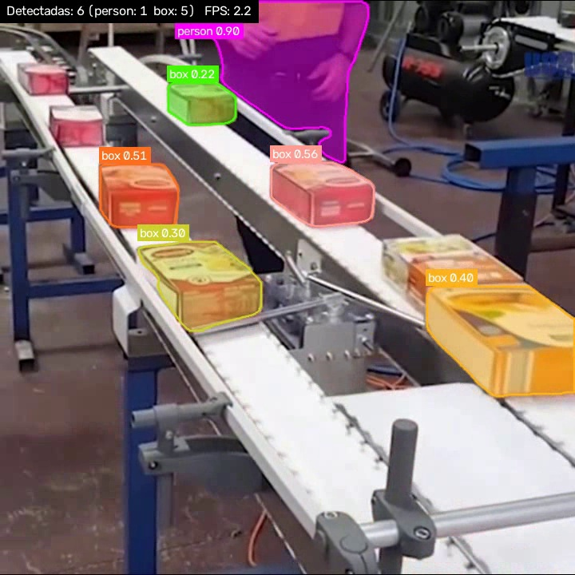

# opencv-yolo-segmentation

Segmentación de instancias de **cajas en un conveyor belt** o de **personas** con YOLO + OpenCV.
Resalta cada caja con una máscara semitransparente, su contorno y una etiqueta con la confianza.
Funciona sobre un video o en vivo desde la cámara.



## Modelos

Según `--target`:

- **`person`**: `yolo26l-seg.pt`, el YOLO de segmentación estándar entrenado en COCO, filtrado a la
  clase `person`. Para personas es más preciso y rápido que un modelo open-vocabulary.
- **`box`** (default): YOLOE, explicado abajo.

Con `--prompts` podés pedir otras clases: con YOLO-seg tienen que ser clases de COCO
(ej. `--target person --prompts person dog`), con YOLOE cualquier texto.

### YOLOE (cajas)

Se usa **YOLOE** (`yoloe-26l-seg.pt`, de [Ultralytics](https://docs.ultralytics.com/models/yoloe/)),
un YOLO de segmentación *open-vocabulary*: en vez de estar limitado a las 80 clases de COCO
(que no incluye "caja"), recibe las clases como texto. Por defecto se le pasan los prompts
`storage box`, `toolbox`, `cardboard box`, `box` y todas las detecciones se muestran como `box`.

Los pesos (y el encoder de texto MobileCLIP) se descargan automáticamente la primera vez.

## Instalación

### Con GPU NVIDIA (recomendado)

Pensado para una **Lenovo Legion 7 16ACHg6** (Ryzen 9 5900HX + GeForce RTX 3070/3080 Laptop).
Cualquier NVIDIA con CUDA sirve igual.

1. Actualizá el driver de NVIDIA (GeForce Experience / nvidia.com). `nvidia-smi` en una terminal
   tiene que mostrar la GPU y un "CUDA Version" ≥ 13.0. No hace falta instalar el CUDA Toolkit:
   los wheels de PyTorch ya traen CUDA.
2. Instalá **PyTorch con CUDA antes** que el resto. En Windows `pip install torch` a secas trae la
   versión de solo-CPU, y ese es el error más común:

```bash
python -m venv .venv
.venv\Scripts\activate          # Windows (en Linux: source .venv/bin/activate)
pip install torch torchvision --index-url https://download.pytorch.org/whl/cu130
pip install -r requirements.txt
python scripts/check_gpu.py      # tiene que imprimir el nombre de la RTX
```

Si tu driver es más viejo y no lo podés actualizar, usá `cu128` o `cu126` en la URL (el selector de
https://pytorch.org/get-started/locally/ te da el comando exacto).

Si `check_gpu.py` dice que CUDA no está disponible, quedó el torch de CPU: corré
`pip uninstall -y torch torchvision` y repetí el `pip install` con `--index-url`.

> En la Legion, si en Lenovo Vantage / BIOS está el modo "Hybrid" igual funciona: CUDA usa la RTX
> aunque la pantalla la maneje la Radeon integrada. Enchufá el cargador: en batería la GPU baja mucho
> el rendimiento.

### Solo CPU

```bash
python -m venv .venv && source .venv/bin/activate
pip install -r requirements.txt
```

## Uso

```bash
# Cajas, sobre el video de ejemplo (data/conveyor_boxes.mp4). Guarda runs/conveyor_boxes_box_seg.mp4
python segment.py

# Personas (con la cámara o sobre un video)
python segment.py --target person --camera
python segment.py --target person --source mi_video.mp4

# Sobre otro video
python segment.py --source mi_video.mp4

# Desde la cámara (índice 0 por defecto, o el que pases)
python segment.py --camera
python segment.py --camera 1
```

Se abre una ventana con el resultado; `q` o `ESC` para salir.

**Guardar imagen:** tocá el botón *Guardar imagen* (abajo a la derecha de la ventana) o la tecla `s`.
Arranca una cuenta regresiva de 5 segundos en pantalla y al llegar a 0 guarda el frame en
`runs/captures/`: `capture_<fecha>.jpg` (con las máscaras) y `capture_<fecha>_raw.jpg` (la imagen
original, útil para armar un dataset). La duración se cambia con `--countdown N`.

Opciones útiles:

| Flag | Descripción |
|------|-------------|
| `--target` | `box` (cajas, default) o `person` (personas). Elige modelo, clases y etiqueta |
| `--camera [N]` | Usar la cámara N como input en lugar del video |
| `--model` | Pesos. Default según target; versiones `s` (`yolo26s-seg.pt`, `yoloe-26s-seg.pt`) son más rápidas y menos precisas |
| `--prompts ...` | Qué segmentar, como texto. Ej: `--prompts box bottle person` |
| `--label` | Etiqueta a mostrar (por defecto `box`; `--label ""` muestra el prompt que matcheó) |
| `--conf` | Umbral de confianza (default 0.2 para cajas, 0.35 para personas) |
| `--device` | Por defecto usa la GPU CUDA si existe; si no, CPU. Forzar con `cuda:0`, `cpu`, `mps` |
| `--no-half` | En GPU se usa FP16 (más rápido); esto fuerza FP32 si hay problemas de precisión |
| `--cam-width` / `--cam-height` | Resolución pedida a la cámara (default 1280x720) |
| `--output` | Guardar el video resultante (con `--camera` solo se guarda si lo pasás) |
| `--no-show` | No abrir ventana (servidores / sin display) |
| `--countdown` | Segundos de cuenta regresiva antes de guardar la imagen (default 5) |
| `--captures-dir` | Carpeta de las capturas (default `runs/captures`) |

Al arrancar imprime qué device usa (ej. `Usando GPU: NVIDIA GeForce RTX 3080 Laptop GPU (FP16)`)
y en la ventana se ve el FPS de inferencia. En CPU `yoloe-26l-seg` anda a ~2 FPS; en una RTX
de laptop debería andar bastante más rápido (no lo medí). Si te hace falta más velocidad, probá `--model yoloe-26m-seg.pt`
o `yoloe-26s-seg.pt`, o bajá `--imgsz` a 480.

## Video de ejemplo

`data/conveyor_boxes.mp4` son frames reales de cajas sobre una cinta transportadora, tomados de
[carrickcheah/Yolo-detection-for-manufacturing](https://github.com/carrickcheah/Yolo-detection-for-manufacturing)
(licencia MIT) y reensamblados a video. Para regenerarlo:

```bash
python scripts/fetch_sample_video.py
```
